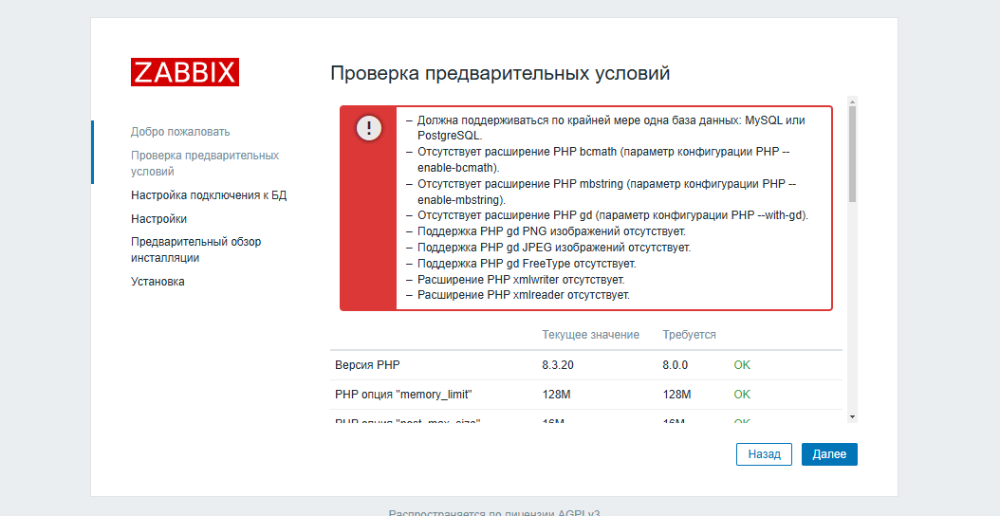
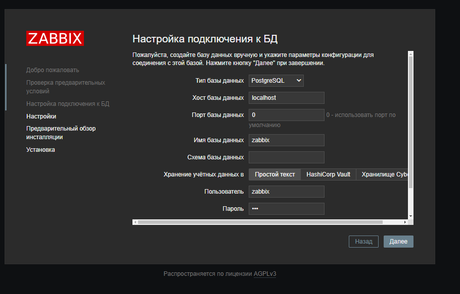
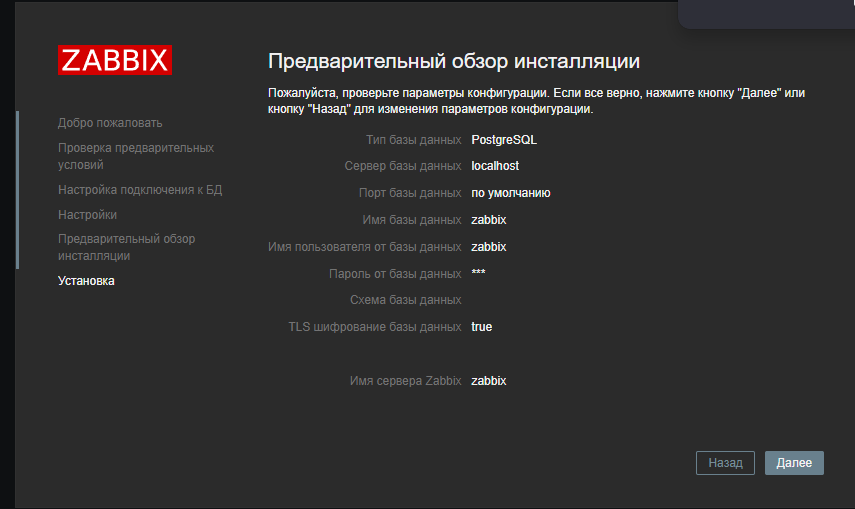
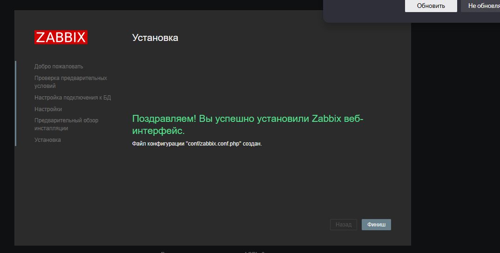
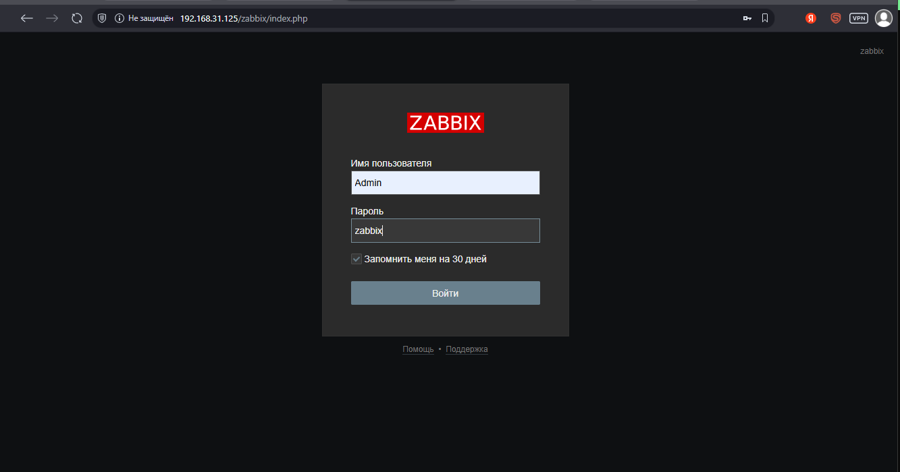
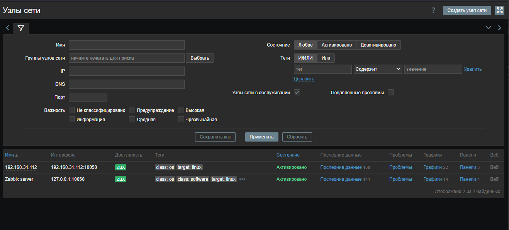
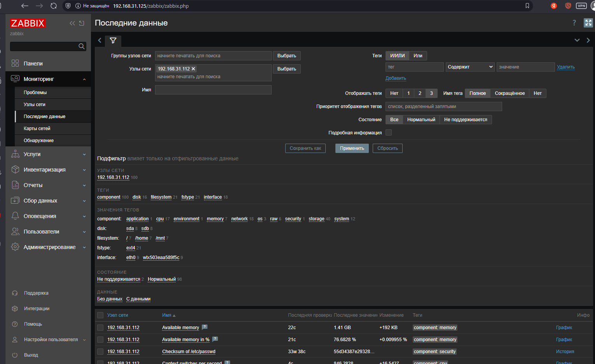
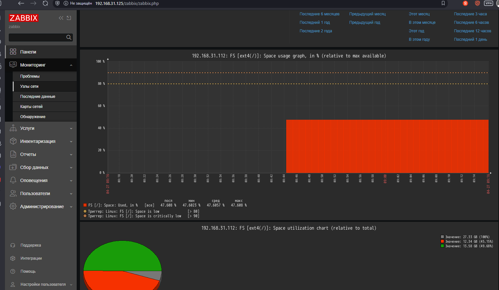
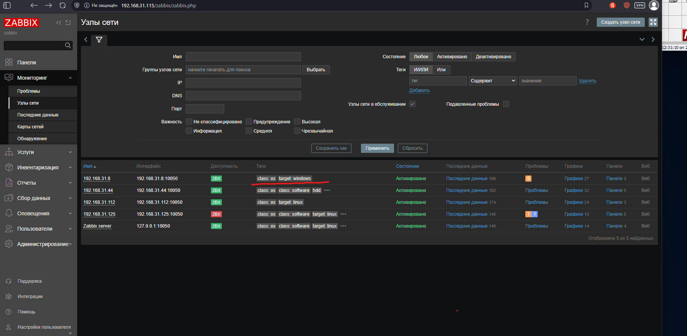
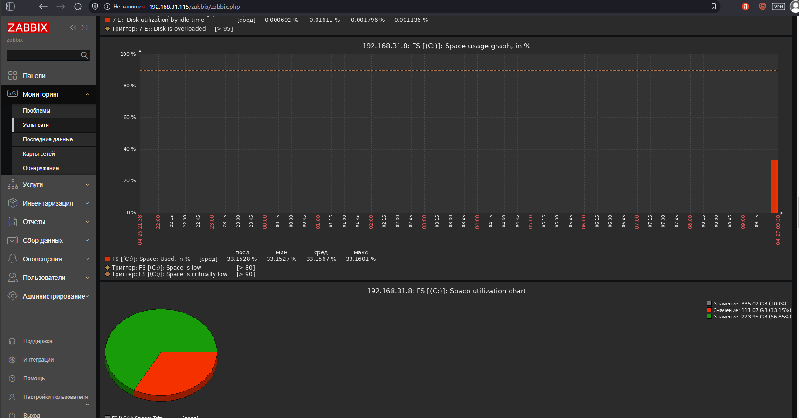

# Утанавливаем postgress
``
apt install postgres
``
```
apt update
apt install postgresql postgresql-client postgresql-contrib

```

# Устанавливаем реппозиторий

``wget https://repo.zabbix.com/zabbix/7.2/release/debian/pool/main/z/zabbix-release/zabbix-release_latest_7.2+debian12_all.deb``
``
dpkg -i zabbix-release_latest_7.2+debian12_all.deb
``

``apt update``

# Уcтанавливаем Zbbix

``apt install zabbix-server-pgsql zabbix-frontend-php php8.3-pgsql zabbix-apache-conf zabbix-sql-scripts zabbix-agent``

#Создаем пользователя

 ``sudo -u postgres createuser --pwprompt zabbix``
 ``sudo -u postgres createdb -O zabbix zabbix``

# Наполняем БД

`` zcat /usr/share/zabbix/sql-scripts/postgresql/server.sql.gz | sudo -u zabbix psql zabbix``

 # Настроим базу данных для Zabbix сервера
Отредактируйте файл /etc/zabbix/zabbix_server.conf

``DBPassword=password``

e. Запустите процессы Zabbix сервера и агента
Запустите процессы Zabbix сервера и агента и настройте их запуск при загрузке ОС.

`` systemctl restart zabbix-server zabbix-agent apache2``
 `` systemctl enable zabbix-server zabbix-agent apache2 ``


``systemctl status zabbix-server zabbix-agent apache2``


# Установка PHP
``sudo apt update``
``sudo apt install -y lsb-release wget``

``echo "deb https://packages.sury.org/php/ $(lsb_release -cs) main" | sudo tee /etc/apt/sources.list.d/php.list``

# Получите и добавьте ключ репозитория:
```
wget -qO - https://packages.sury.org/php/apt.gpg | sudo apt-key add -

echo "deb https://packages.sury.org/php/ $(lsb_release -cs) main" | sudo tee /etc/apt/sources.list.d/php.list

wget -qO - https://packages.sury.org/php/apt.gpg | sudo tee /etc/apt/trusted.gpg.d/php.gpg

sudo apt update

sudo apt install php8.3 libapache2-mod-php8.3 php8.3-cli php8.3-common

sudo apt install php8.3-pgsql php8.3-xml php8.3-mbstring php8.3-curl php8.3-zip php8.3-gd

sudo apt install php8.3-pgsql php8.3-xml php8.3-mbstring php8.3-curl php8.3-zip php8.3-gd


```


## Проверим статус
``
systemctl status zabbix-server zabbix-agent apache2 | grep -B 3 Active:
``


проверяем web интерфейс


Получаем ошибки 

Исправляем 

```
  sudo apt update
  sudo apt install php8.3 php8.3-cli
  sudo apt install php8.3-bcmath
```

Подключаем БД



учтанавливаем





Сброс пароля:
```
sudo -u postgres psql
\c zabbix

#пароль zabbix

UPDATE users SET passwd = '$2a$10$ZXIvHAEP2ZM.dLXTm6uPHOMVlARXX7cqjbhM6Fn0cANzkCQBWpMrS' WHERE username = 'Admin';
\q
sudo systemctl restart zabbix-server
```




### Подключаем агент

``sudo nano /etc/zabbix/zabbix_agentd.conf``


### Настроим хосты








Установим и настроим zabbix-agent на windows
 

Свободное место на диске C:

